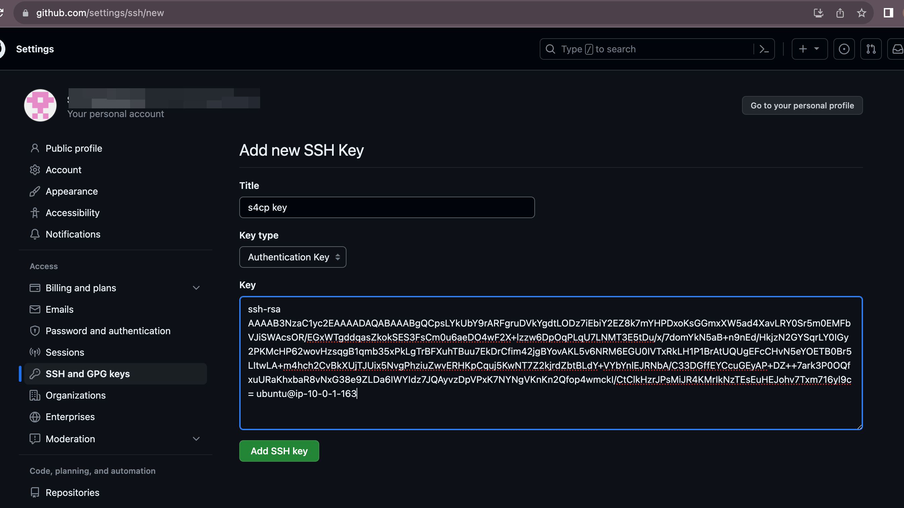
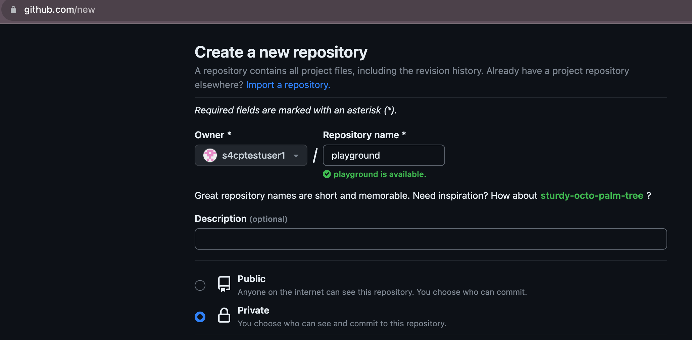

# 🐙 Github Account Setup

We'll be exclusively using Github for CI (Continuous Integration) and Github Actions (Continuous Delivery) throughout this course. Hence, its critical to set things up as required to run this training smoothly.

## 🔑 SSH Key

In this section we'll setup the Github repository and configure Github access which will be used throughout the course.

### 🍔 Configure Github SSH Key <i class="fa fa-flask" aria-hidden="true"></i>

Configure and copy the SSH Key

```bash
cd ~
ssh-keygen
cat ~/.ssh/<key_name>
```


- Open <a href="https://github.com/settings/keys">https://github.com/settings/keys</a> where you signed-in recently.
- Copy the public ssh key in the respective section and click on `Add SSH Key`.



## 🌟 Create a Github Repository

- Create a new repository by visiting the link <a href="https://github.com/new" target="_blank">https://github.com/new</a> and name it as `playgroud`
- Ensure visibility is private.

:::danger Repository Name

For progressing with this course ensure that the name of your repository is `playground` as lot of commands ahead will be based on this name.

:::



That's all your Github setup is good to go 🎉