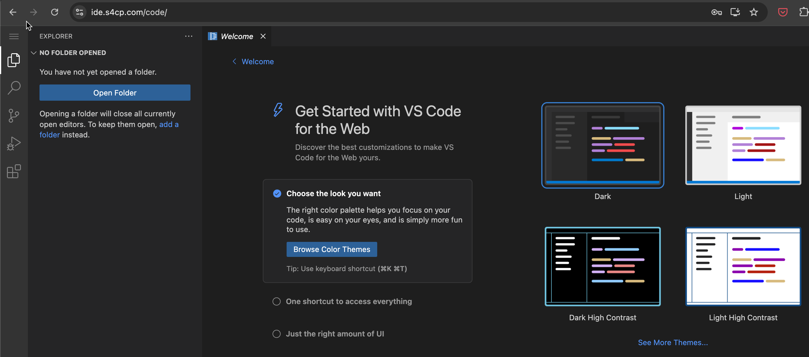

# 💻 Cloud Desktop Setup

In order to follow this training there is a long list of tools that are required to be installed. Hence, I created [https://github.com/salecharohit/my-cloud-desktop](https://github.com/salecharohit/my-cloud-desktop) which contains everything to follow this training. Hence, strongly recommended to follow this and ensure that your Cloud Desktop is setup so that we can access our web-based IDE and follow along the training from there.

:::danger

Please ensure to have completed the [Domain Name Setup](docs/chapter0-setup/domain-setup.md#) prior to moving ahead with this page.

:::

## 📋 Git Clone

Let's first clone the repository in our local machine and open it in your favourite code editor

```bash {1-2}
git clone git@github.com:salecharohit/my-cloud-desktop.git
cd my-cloud-desktop
```

## ✳️ Configuring terraform.auto.tfvars

The `terraform.auto.tfvars.bak` is an important file that needs to be edited before we deploy the cloud desktop. Please review all the variables in the file and ensure that its correctly configured.

```hcl showLineNumbers
# Region of deployment of EC2, its recommended to deploy closest possible to avoid latency
region = "ap-south-1"
# Recommneded is t3.medium or select from here https://instances.vantage.sh/
instance_type = "t3.medium"
#Whether to apply source IP restrictions for SSH Access. IP Address from where you are executing the terraform script will be used to restrict #SSH Access. Check file networking.tf L30
apply_source_ip_restriction = false
hostname                    = "example.com"
vscode_password             = "gokuismyhero"
key_name                    = "ubuntu"
```

1. L2 `region` should be the closest region to your location to reduce latency
2. L4 `instance_type` is recommended to be `t3.medium or above`
3. Ensure L7 contains the proper domain name that was configured in the [Domain Name Setup](docs/chapter0-setup/domain-setup.md#) section.
4. Ensure a strong password is configured in L8 as it'll be a public facing website where your VSCode interface will be accessible on `https://ide.domain.com/code/`
5. `key_name` on L9 is arbitrary and can be set as `ubuntu` 
6. Once your done adding the relevant information we need to remove the .bak so that terraform can read the file for processing
```bash
mv terraform.auto.tfvars.bak terraform.auto.tfvars
```
   


:::tip Power of .gitignore

The `terraform.auto.tfvars`  is added in .gitignore if your repository hence,this file won't be commited to github.com.
Additionally, a ubuntu.pem file which is a private key for your SSH is also configured but is added in gitignore for safety of not being committed.
:::

## ▶️ Start it Up

Now, that the variables are configured let's start up our cloud desktop and access it over `ide.domain.com/code/` by firing the following commands

```bash
export AWS_PROFILE=admin
terraform init
terraform validate
terraform apply --auto-approve
```

## 🚪 Accessing the Web-IDE

You can now access your IDE on [https://ide.your-domain.com/code/](https://ide.your-domain.com/code/) 



This is nothing but your own VSCode but on cloud.