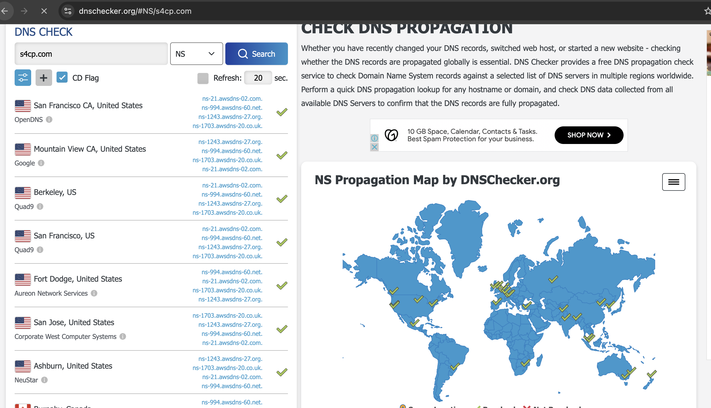

# 🏢 Domain Setup

For running this course we will need a Top-Level Domain name or a Sub-Domain whose NameServers are in your control.
If you donot have a domain , I'd recommend to buy it from any public Domain Registrar. If you already have a domain, then you can simply add a sub-domain and continue with this course. 

For the purpose of this course,I purchased a domain called `s4cp.com` and will be using the same for all examples. You are expected to use your own domain/sub-domain by simply replacing it with `s4cp.com` 

:::danger Domain or Sub-Domain

Follow any one of the below setup and not both, depending on what you'd wish to use, either a domain or a sub-domain. Also, please ensure you've completed the [AWS Setup](/docs/chapter0-the-setup/aws-setup.md#) page prior to moving ahead with this page.

:::

## 🗻 Top-Level Domain

If you wish to configure a Top-Level domain name for deploying our application then fire the command below replacing s4cp.com with your domain name.

```bash {1,2}
export AWS_PROFILE=admin
aws route53 create-hosted-zone --name s4cp.com --caller-reference $(date +%s)


{
XXXXXXXXXXXXXXX------SNIPPED-------XXXXXXXXXXXXXXXXXXXXX
    "DelegationSet": {
        "NameServers": [
            "ns-849.awsdns-42.net",
            "ns-290.awsdns-36.com",
            "ns-1129.awsdns-13.org",
            "ns-1713.awsdns-22.co.uk"
        ]
    }
}
```

The command output provides 4 different Nameserver values that need to be configured with your DNS provider by overriding their current values. You’ll need to refer to your hosting/DNS provider documentation to be able to do the same.

For Ex: If you have GoDaddy as your DNS provider then follow this guide [https://in.godaddy.com/help/change-nameservers-for-my-domains-664](https://in.godaddy.com/help/change-nameservers-for-my-domains-664)

Following are the sub-domains that will be created throughout this course if a top-level domain is chosen.

- ide.s4cp.com
- prod.s4cp.com
- dev.s4cp.com

:::danger

If you’ve done for Top Level Domain DONOT repeat this for Subdomain below.

:::

## ⛺ Sub-Domain

If you already own a Top-Level domain and wish to utilize a subdomain only then you fire the below command and replace your subdomain with `aws.s4cp.com`

```bash {1,2}
export AWS_PROFILE=admin
aws route53 create-hosted-zone --name aws.s4cp.com --caller-reference $(date +%s)

{
XXXXXXXXXXXXXXX------SNIPPED-------XXXXXXXXXXXXXXXXXXXXX
	"DelegationSet": {
    	"NameServers": [
        	"ns-537.awsdns-03.net",
        	"ns-449.awsdns-56.com",
        	"ns-1848.awsdns-39.co.uk",
        	"ns-1415.awsdns-48.org"
    	]
	}
}
```

The command will output a set of Nameservers which you need to add as a record just like how you would add any other record in your DNS zone.

You’ll need to refer to the documentation of your DNS service provider on how to perform the same. 
For Ex: in GoDaddy this is how you can add a NS as a record https://in.godaddy.com/help/add-an-ns-record-19212

Following are the sub-domains that will be created throughout this course if a sub-domain is chosen.

- ide.aws.s4cp.com
- prod.aws.s4cp.com
- dev.aws.s4cp.com

:::tip SubDomain Delegation

Both the above techniques have different implications; for Top-Level Domain we are modifying the primary Nameserver records whereas for Subdomain we are only adding a Nameserver record against the subdomain. This adding of nameservers as a record in your DNS zone is also called as Subdomain Delegation. Effectively we are delegating the subdomain to another provider. An important point to note here is that not all DNS providers support this.

:::

## ✅ Check DNS Propagation

Once. you've configured your DNS domains using either one of the methods above, do check for your DNS Propogation before moving ahead with the course. In the below link simply replace `s4cp.com` with your DNS name that you configured. 

For Top-Level Domain

`https://dnschecker.org/#NS/s4cp.com` 

For Sub-domain

`https://dnschecker.org/#NS/aws.s4cp.com`

All NS servers should show the AWS DNS servers to be configured like below



<details>
  <summary> ❌ Deleting Route53 Zone </summary>

In case you've made an error and would like to re-create the Route53 Zones, ensure that you delete the old ones. To do that fire the below commands. Replace `s4cp.com` with your domain name that you wrongly entered. Do Note  it is

```bash
export AWS_PROFILE=admin
aws route53 delete-hosted-zone --id $(aws route53 list-hosted-zones --query "HostedZones[?Name == 's4cp.com.'].Id" --output text | sed 's|/hostedzone/||')
```

</details>


