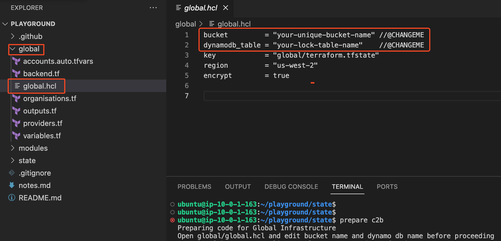
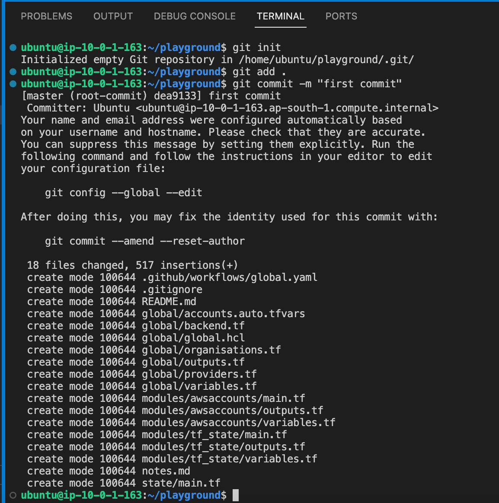

# 2.2.2 Setting Up AWS Organisations

In this section we'll activate our AWS Organization and create the required identity,prod and development 

## ⚙️ Setup AWS Organizations

Let's go ahead and setup our AWS Organization. Below command will setup the code that will setup the Root,Prod,Dev and Identity accounts.

```bash
cd ~/playground
cp -r ~/s4cpcode/chapter2/2B/. ~/playground/
```

## ✏️ Edit accounts.auto.tfvars

- Every AWS account needs a unique Email address for recovery and identity purposes. Hence, we first need to provide the email addresses we'll be using for different sub-accounts that'll be creating.
- Below is the sample file that stores the information of the email addresses that'll be used for creating the respective AWS accounts.

```hcl title="global/accounts.auto.tfvars"
accounts = {
  dev = {
    name  = "dev"
    email = "email+dev@gmail.com" #@CHANGEME
  },
  identity = {
    name  = "identity"
    email = "email+identity@gmail.com" #@CHANGEME
  },
  prod = {
    name  = "prod"
    email = "email+prod@gmail.com" #@CHANGEME
  }
}
```

So if your email address is let's say `s4cpuser@gmail.com` then your `global/accounts.auto.tfvars` should look like

```hcl title="global/accounts.auto.tfvars"
accounts = {
  dev = {
    name  = "dev"
    email = "s4cpuser+dev@gmail.com" #@CHANGEME
  },
  identity = {
    name  = "identity"
    email = "s4cpuser+identity@gmail.com" #@CHANGEME
  },
  prod = {
    name  = "prod"
    email = "s4cpuser+prod@gmail.com" #@CHANGEME
  }
}
```


## ✏️ Edit global.hcl

- Open `global/global.hcl`



- Edit bucket name and dynamo db name that can be copied from notes.md saved earlier.


## ✔️ Commit The changes

```bash
git init
git branch -m main
git add .
git config --global user.name <username>
git config --global user.email <email>
git commit -m "first commit"
```



## ⬆️ Push The changes

```bash
git remote add origin git@github.com:<username>/playground.git
git push -u origin main
```


