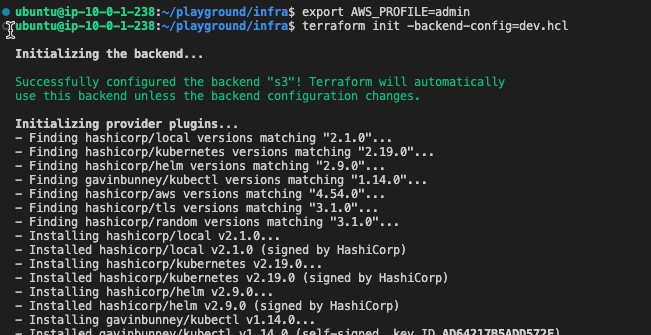
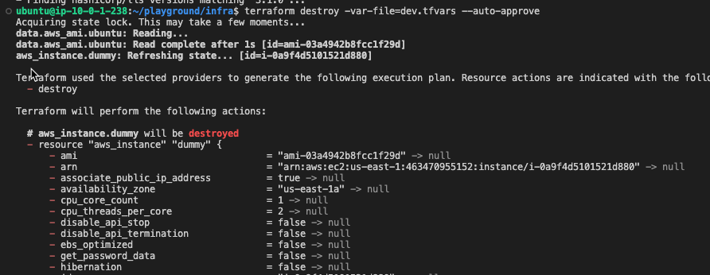

# 2.5.5 Destroying Environments

Now that our demonstration for the multi-environment workflow is completed, let's destroy the EC2s that were created as its not something we need for the course ahead. We can do it be using the `admin` credentials configured earlier in our [AWS Setup](/docs/chapter0-the-setup/aws-setup.md) section.

## ↩️ Rebasing Git

- First thing we need to do is to rebase our code in the [Cloud Desktop](/docs/chapter0-the-setup/cloud-desktop-setup.md) to the latest in the `main` branch.

```bash
cd ~/playground
git checkout main
git pull
```

## ❌ Destroy Dev environment

- Open the CLI on the [Cloud Desktop](/docs/chapter0-the-setup/cloud-desktop-setup.md) and fire the following commands to initalise the `dev` environment state locally and then destroy the `dev` environment

```bash
cd ~/playground/infra
export AWS_PROFILE=admin
terraform init -backend-config=dev.hcl
```



```bash
cd ~/playground/infra
export AWS_PROFILE=admin
terraform destroy -var-file=dev.tfvars --auto-approve
```



## ❌ Destroy Prod Environment

Similarly, fire the below commands to destroy `Prod` environment

```bash
cd ~/playground/infra
export AWS_PROFILE=admin
terraform init -backend-config=prod.hcl -reconfigure
terraform destroy -var-file=prod.tfvars --auto-approve
```

:::note End of Chapter 2

That completes the Chapter 2, before you move to Chapter 3

- Ensure that you've created the [OIDC Github Role,Global S3 bucket and Dynamod DB](/docs/chapter2-securing-iam/initiate/run_code.md) for storing the state
- You've created the different AWS accounts using [AWS Organisations](/docs/chapter2-securing-iam/aws_organisations/setting_up_aws_organizations.md)
- Created the different [IAM Roles and Route53 Zones](/docs/chapter2-securing-iam/aws_iam_roles/creating_iam_roles_groups.md) that'll be used for the `prod` and `dev` accounts for the future chapters.
- Created [IAM Users](/docs/chapter2-securing-iam/aws_iam_users/creating_aws_iam_users.md) and configured their [Console and CLI Access](/docs/chapter2-securing-iam/aws_iam_users/configuring_goku_access.md) to AWS cloud.
- And finally, understood and executed the [multi-environment strategy](/docs/chapter2-securing-iam/multi_environment_strategy/multi_environment_strategy.md) to execute code first in `dev` and then in `prod` 
:::