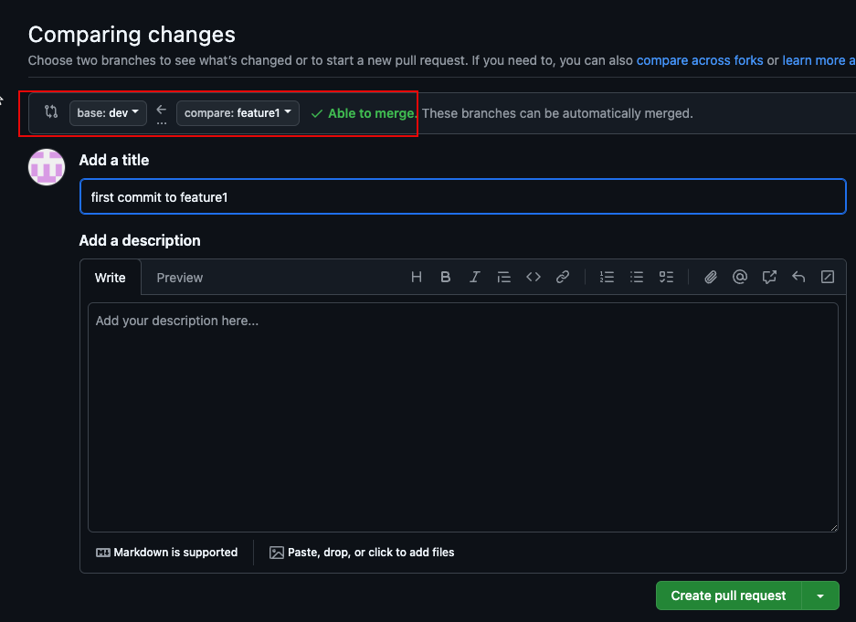
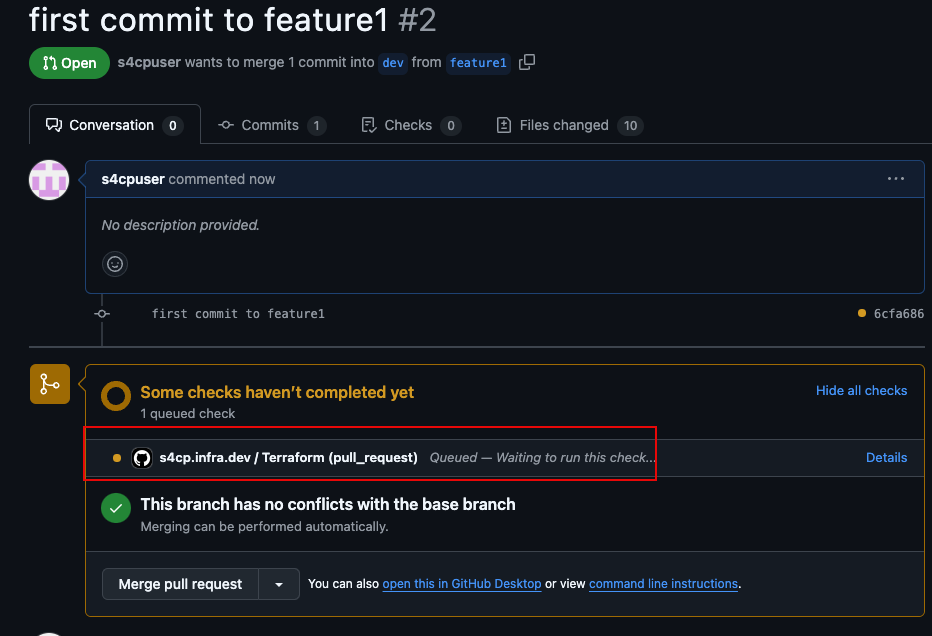
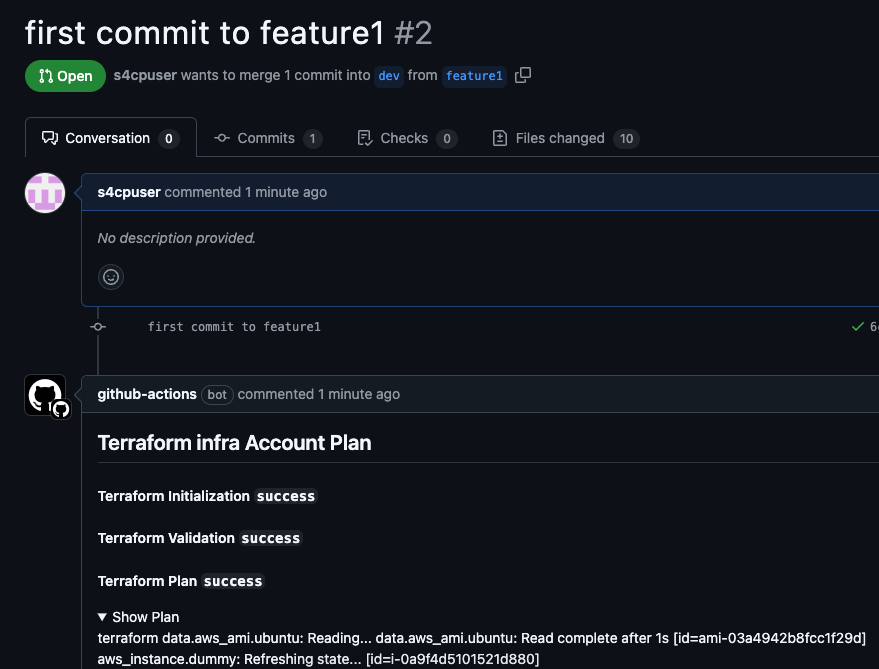
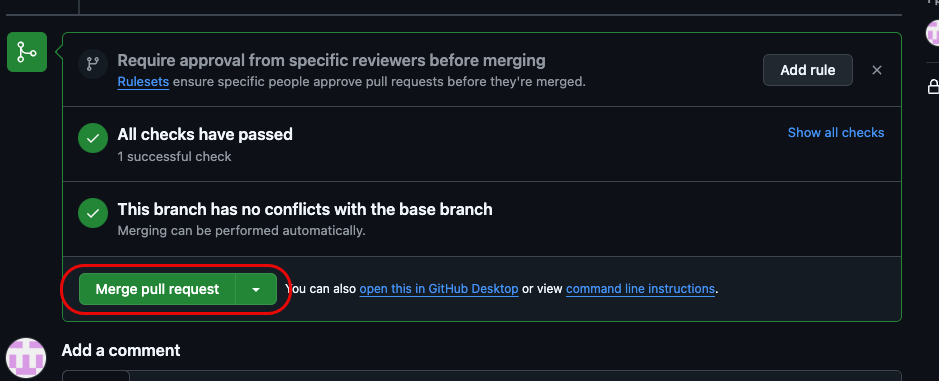

# 2.5.3 Dev Environment

[Youtube 📺](https://www.youtube.com/watch?v=Am9417a87zU&t=3034s)

In this section we'll create an EC2 in the `dev` environment through the `dev` pipeline by pushing code into the `feature1` branch and merging the `feature1` branch with the `dev` branch.

## ⬆️ Push Changes to Feature1 branch

The below command will create a `feature1` branch and push the changes in it.

```bash
git checkout -b feature1
git add .
git commit -m "first commit to feature1"
git push --set-upstream origin feature1
```

## 🔄 Create PR feature1 to dev

- Let's visit github.com and check the PR message being shown


- Let's click on `Compare & Pull Request` and select `base:dev` and `compare:feature1` as shown below



- Click on `Create Pull Request` and observe that the dev workflow getting activated



- The PR will show the expected terraform changes in comments as shown below 



## 🔀 Merging PR

- Let's now merge the Pull Request, which will activate the dev workflow to create an EC2 instance in the `dev` environment. Click on `Merge Pull Request` and then `Confirm Merge`.



- Visit Github Actions page and you'll see the dev workflow in action


- Terraform Apply will be executed and an EC2 instance will be created in the `dev` environment as shown below


