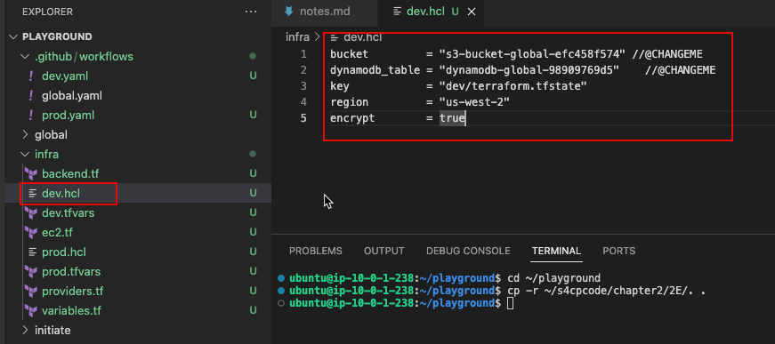
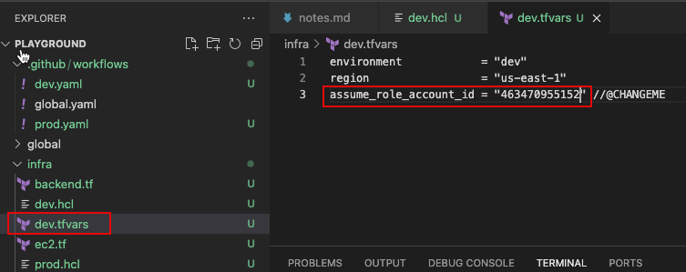

# 2.5.2 Preparing the Environments

[Youtube 📺](https://www.youtube.com/watch?v=Am9417a87zU&t=2869s)

For the purpose of this training we are implementing the multi-environment strategy by utilizing the DRY(don't repeat yourself) principle where we are using the same code base for dev and prod environment in the `infra` folder for setting up the respective environments using different CI/CD workflows and separate variable configurations. Let's see how that can be done.

```bash
cd ~/playground
cp -r ~/s4cpcode/chapter2/2E/. ~/playground
```

:::warning

Please ensure you feed in the information as requested in the respective files, else your code will error out.

:::

## ➕ Create dev branch

- Let's create a dev branch which is an empty branch as of now, but soon we'll create a PR to populate it.

```bash
git checkout -b dev
git push origin dev
```

:::note

`dev` and `main` branches will correspond to `dev` and `prod` environment throughout this course.

:::

## ⚙️ Prepare Dev Environment

We need to now populate the required details like the account ID, S3 buckets and DynamoDB for storing the Terraform state. There are two files that need to be updated viz. `dev.hcl` and `dev.tfvars`.

### ✏️ Edit infra/dev.hcl

This file will point to the location where the dev environment terraform state will be configured. Here,we need to point it to the global s3bucket and dynamoDB table that were created in the [initiate module](/docs/chapter2-securing-iam/initiate/run_code.md#️-creating-s3ddb-and-oidc)

- Open dev.hcl and add the following information from notes.md
  - s3bucket : The global s3 bucket
  - dynamoDB : The global dynamodDB



### ✏️ Edit infra/dev.tfvars

- Open `dev.tfvars` and add the following information from notes.md
    - assume_role_account_id : Replace `<dev-account-id>` with the actual id of the dev account



## ⚙️ Prepare Prod Environment

Similarly, we now need to populate information in `prod.hcl` and `prod.tfvars` for the Prod environment.

### ✏️ Edit infra/prod.hcl

This file will point to the location where the prod environment terraform state will be configured. Here,we need to point it to the global s3bucket and dynamoDB table that were created in the [initiate module](/docs/chapter2-securing-iam/initiate/run_code.md#️-creating-s3ddb-and-oidc)

- Open `prod.hcl` and add the following information from notes.md
  - s3bucket : The global s3 bucket
  - dynamoDB : The global dynamodDB


### ✏️ Edit infra/prod.tfvars

- Open `prod.tfvars` and add the following information from notes.md
  - assume_role_account_id : Replace `<prod-account-id>` with the actual id of the dev account


:::tip .hcl files

the dev.hcl,global.hcl and prod.hcl all contain the same information except the `key` which points to the respective environments. This is done to segregate the state files based on their environment information.

:::
