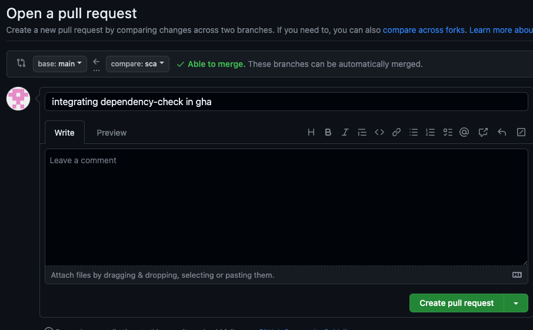
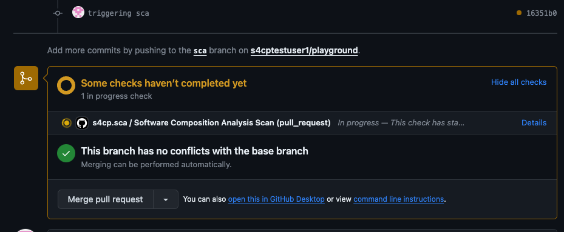
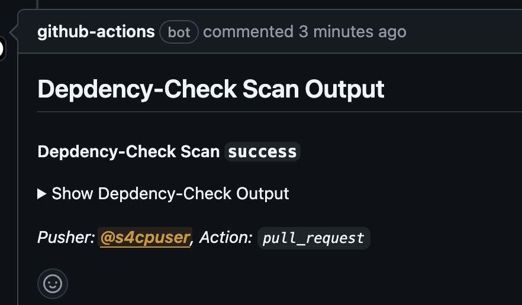
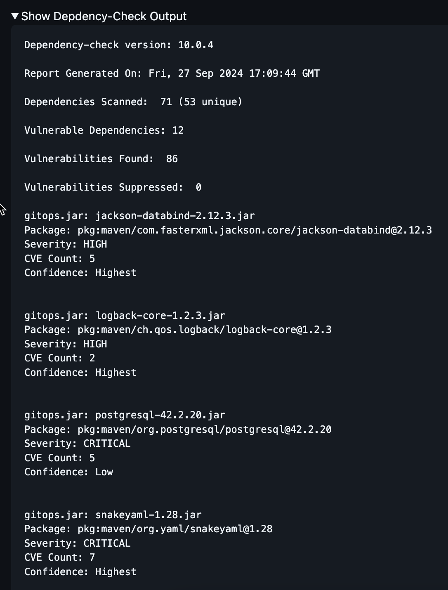

# 3.2.2 Introduction to Dependency-Checker

[Youtube 📺](https://www.youtube.com/watch?v=Am9417a87zU&t=3919s)

Dependency-Checker is a valuable tool in the realm of software security. It is designed to scan and analyze an application's open-source dependencies for known vulnerabilities, offering a proactive approach to security. Dependency-Checker works by examining the libraries and components used in an application, cross-referencing them with extensive vulnerability databases, and providing comprehensive reports on potential security issues. By offering insights into these vulnerabilities, it enables developers to address and remediate them early in the software development lifecycle, reducing the risk of security breaches and enhancing the overall security posture of the application.

[https://github.com/jeremylong/DependencyCheck](https://github.com/jeremylong/DependencyCheck)

Let's us look at integrating Dependency-checker using the `sca.yaml` Github Action that gets triggered whenever there is a change happening in pom.xml file.

## ➕ Integrating Dependency-Checker in GHA

The command below will:

- Update the code base with code for integrating dependency-checker Github action `sca.yaml`.
- Create a new branch called `sca` and push the code into the branch.

```bash
cd ~/playground/
git checkout main
git pull
cp -r ~/s4cpcode/chapter3/3C/. ~/playground/
```

- Checking Out Dependency Checker Github Action in sca branch

```bash
git checkout -b sca
git status
git add .
git commit -m "integrating dependency-check in gha"
git push --set-upstream origin sca
```

## 🔄 Create PR

- Let's create a PR from `sca` branch to `main` branch


- Open the Pull Request as shown below



## ⚡ Triggering Dependency-Checker in GHA

Our code will not auto-trigger the GHA hence, let's just make a small change so that it goes about triggering the github action

```bash
cd ~/playground/app
# Remove First line from pom.xml    
tail -n +2 pom.xml > temp.xml && mv temp.xml pom.xml
git status
git add .
git commit -m "triggering sca"
git push --set-upstream origin sca
```



## 🔍 View PR

- View the PR comments as shown below especially that displaying the dependency-checker output as shown below



- View the Dependency Check output



## 🔗 Merge PR

- Merge the PR and commit the changes.


## 👁️ View Dependency-Check Artifact

- Once the PR is merged SCA GHA will produce an artifact containing complete Dependency-Check report as shown below.


