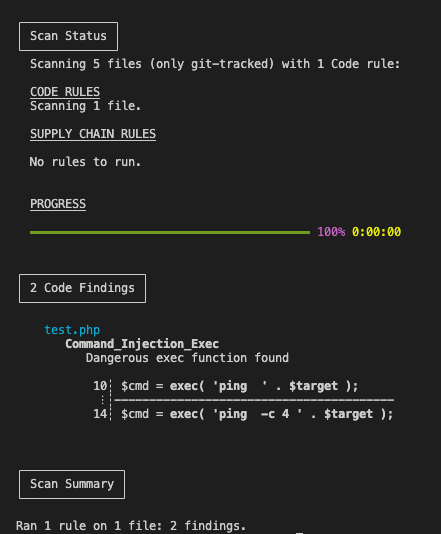
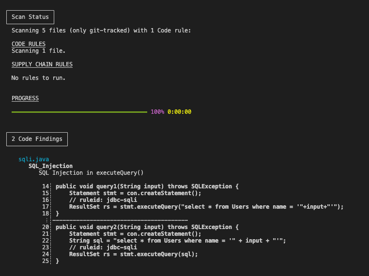

# Introduction to Semgrep

Sempgrep is a powerful open-source static analysis tool that empowers developers and security professionals to identify and remediate security issues and code quality problems in their codebase. With its user-friendly rules and queries, Semgrep provides an efficient and customizable way to scan code for vulnerabilities and misconfigurations. It's a valuable addition to any development or security workflow, helping teams ensure the integrity and security of their software projects.

Let's better understand semgrep with two practical examples

## Dangerous functions in PHP

Below is the PHP file stored as test.php in our current folder. 
test.php accepts a parameter called IP which is then given to the `exec` function for checking reachability.

```php
<?php

if( isset( $_POST[ 'Submit' ]  ) ) {
	// Get input
	$target = $_REQUEST[ 'ip' ];

	// Determine OS and execute the ping command.
	if( stristr( php_uname( 's' ), 'windows' ) ) {
		// Windows
		$cmd = exec( 'ping  ' . $target );
	}
	else {
		// *nix
		$cmd = exec( 'ping  -c 4 ' . $target );
	}

	// Feedback for the end user
	$html .= "<pre>{$cmd}</pre>";
}

?>
```

Below is a simple semgrep rule in yaml format that is checking for patterns accepting any number of variables in the `exec` function.

```yaml
rules:
  - id: Command_Injection_Exec
    patterns:
      - pattern: exec(...)
    message: Dangerous exec function found
    languages:
      - php
    severity: WARNING
```

Let's try to execute this semgrep rule on test.php and check if it is able to identify presence of an exec function.

```bash
cd ~/s4cpcode/chapter3/3A/
semgrep scan -c php.yaml
```



As can be seen the semgrep rule does identify the exec function which is a dangerous function and we now need to manually investigate. This is extremely helpful when the code base is large as Semgrep can execute the scan very fast.

## SQL Injection in Java

Similarly, now we'd like to identify if semgrep can catch SQL Injection bugs in Java. 

Below is the Java file which we'd like to run our semgrep rule against.

```java
package testcode.sqli;

import java.sql.Connection;
import java.sql.ResultSet;
import java.sql.SQLException;
import java.sql.Statement;

public class Jdbc {

    Connection con;

    public void query1(String input) throws SQLException {
        Statement stmt = con.createStatement();
        // ruleid: jdbc-sqli
        ResultSet rs = stmt.executeQuery("select * from Users where name = '"+input+"'");
    }

    public void query2(String input) throws SQLException {
        Statement stmt = con.createStatement();
        String sql = "select * from Users where name = '" + input + "'";
        // ruleid: jdbc-sqli
        ResultSet rs = stmt.executeQuery(sql);
    }
    
}
```

What we need to check in this Java file for SQL Injection is that the `executeQuery` function must not contain a query that has been concatenated. If there is concatenation it means there is a possibility of SQL Injection.
The semgrep rule below has defined two types of patterns that are attempting to check for concatenation either in a string or directly inside the executeQuery function.

```yaml
rules:
  - id: SQL_Injection
    patterns:
    - pattern-either:
      - pattern: | #executeQuery
          $RETURN $METHOD(...,String $VAR, ...) {
            ...
            $SQL = $X + $VAR + $Y;
            ...
            $W.executeQuery($SQL, ...);
            ...
          }
      - pattern: | #executeQuery
          $RETURN $METHOD(...,String $VAR, ...) {
            ...
            $W.executeQuery($X + $VAR + $Y, ...);
            ...
          }
    message: SQL Injection in executeQuery()
    languages:
      - java
    severity: WARNING
```

Let's try to execute this semgrep rule on sqli.java and check if it is able to identify SQL Injection.

```bash
semgrep scan -c sqli.yaml
```


