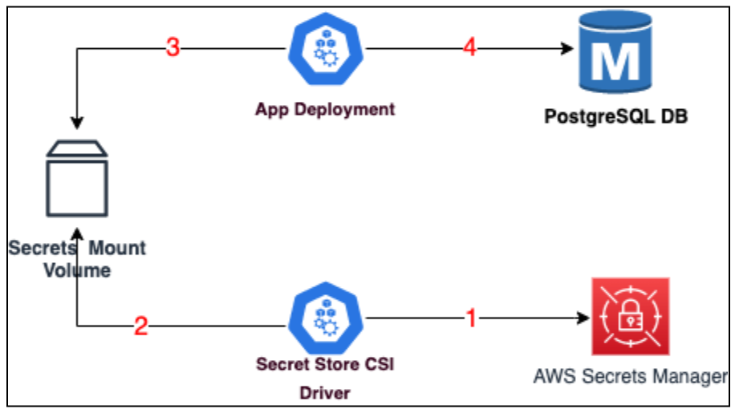

# 5.3.2 Secrets Management in EKS

[Youtube 📺](https://www.youtube.com/watch?v=Am9417a87zU&t=6408s)

Secrets management in Amazon EKS (Elastic Kubernetes Service) is simplified and enhanced by using AWS Secrets Manager and the Container Storage Interface (CSI) Secrets.

The diagram below shows the relationship between the three components


1. Terraform generates a random password and stores it in the Database
2. Once the RDS is setup it writes the password as in AWS Secrets Manager
3. Terraform builds the kubernetes manifest file with the name of the key that is used to store the password in the AWS Secrets Manager ex : db_password
4. Upon successful deployment of the Secrets Store CSI driver, it’ll read the password string from AWS Secrets Manager using the name of the key that was passed i.e. db_password and create a kubernetes secrets volume object.

In this design we are not relying on Terraform to build the manifest descriptor file of the deployment to inject the secret. Rather we are using the Secrets Store CSI driver to pull the secret from AWS Secrets Manager and then make it available to the deployment before the deployment starts its execution.

So how does the Secret Store CSI Driver really work ? Let’s understand using the diagram below.



1. The Secret Store CSI Driver is a deployment configuration which will read the secrets from the AWS Secrets Manager from a specified path and location ex: db_password
2. Once it reads the value it will write it to a secret mount volume as an object with a name as db-password-secret. 
3. The App deployment will read the db-password-secret object from the secrets volume and obtain the database password which will be stored as an environment variable. However, this time since it’s a mounted volume from where the data is being read it won’t be shown in clear-text in the deployment descriptor. We’ll see this practically when we run the entire application.
4. The deployment then connects to the RDS database using the password.

## 🔑 Implementing Secrets Management in EKS

Let us now see this entire process being implemented through the following command

```bash
cd ~/playground/
cp -r ~/s4cpcode/chapter5/5E/. ~/playground/
git status
git add .
git commit -m "secrets management"
git push
```

