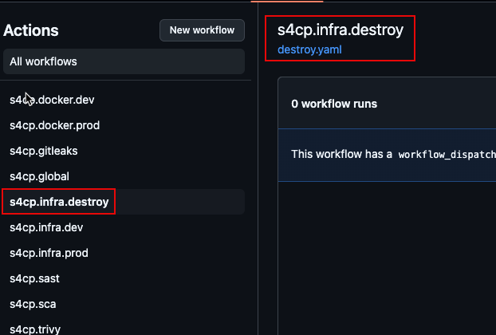
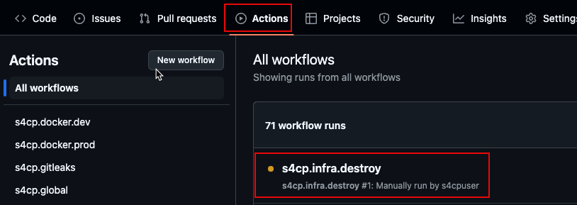
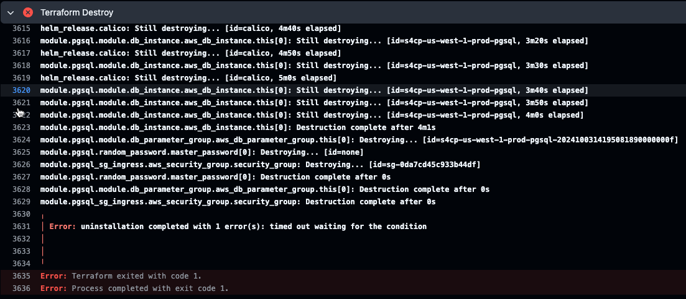

# 💣 Destroy

[Youtube 📺](https://www.youtube.com/watch?v=Am9417a87zU&t=8140s)

Once you are done with the course , it is necessary to start destroying the infrastructure that was created as keeping it on can cost you. **So if you do wish to destroy the course infrastructure please follow the steps in the order provided else, you'll need to manually log into the console and destroy everything by hand.**

## 1. Destroy Prod Infrastructure

- First we need to destroy the Prod infrastructure, for that we need to execute the s4cp.infra.destroy action as shown below



- Click on Run Workflow as shown below and all the workflow to start.


- If you click back on Actions, you can see the workflow start, It should take about minutes to completely destroy the infrastructure.



:::tip

In an event like below , where the destroy run is not successful, just re-run the workflow again.



Alternatively, you can run the below commands from the Web-IDE to destroy the prod infrastructure manually.

```bash
export AWS_PROFILE=admin
cd ~/playground/infra
terraform init -backend-config=prod.hcl
terraform destroy --auto-approve -var-file=prod.tfvars
```

:::

## 2. Delete MFA Devices

- It is necessary to first delete the MFA devices of the users `goku` and `vegeta` , follow the commands below to do the same.

> Please replace `identity-account-number` 

```bash
# Login as IAMAdmin
awsmfa -i goku arn:aws:iam::<identity-account-number>:role/AssumeRoleIAMAdminWithMFA

export AWS_PROFILE=default

# Deactivate & Delete the MFA devices
aws iam list-mfa-devices --user-name vegeta --query 'MFADevices[*].SerialNumber' --output text | xargs -n1 -I {} sh -c 'aws iam deactivate-mfa-device --user-name vegeta  --serial-number {}; aws iam delete-virtual-mfa-device --serial-number {}'

aws iam list-mfa-devices --user-name goku --query 'MFADevices[*].SerialNumber' --output text | xargs -n1 -I {} sh -c 'aws iam deactivate-mfa-device --user-name goku --serial-number {}; aws iam delete-virtual-mfa-device --serial-number {}'
```

> It will not show any response


## 3. Destroy Global Infrastructure

- Execute the following commands from the Web-IDE to destroy the Global infrastructure

```bash
export AWS_PROFILE=admin
cd ~/playground/global
terraform init -backend-config=global.hcl
terraform destroy --auto-approve
```

:::warning Removing AWS Accounts

AWS Accounts (created using AWS Organizations) cannot be deleted using Terraform and hence the only way to delete them is follow the below steps.

- Reset password of the root user for each of the above accounts using the forgot password functionality. Please set a strong password and enable 2FA if possible.
- You can now close your account by simply navigating to the Accounts section here scroll down and Close account.
Then go back to the main root account

Below is the expected error message after running `terraform destroy` on the global infrastructure.


:::

## 4. Destroy State Infrastructure

- Destroy the state infrastructure and the OIDC IAM Role created in the [initiate](/docs/chapter2-securing-iam/initiate/run_code.md) chapter.

```bash
export AWS_PROFILE=admin
cd ~/playground/initiate
terraform init
terraform destroy --auto-approve
```

## 5. Destroy My-Cloud-Desktop

- Now moving back to your local machine where you installed my-cloud-desktop or the WEB-IDE.

```bash
# CD into location wherever you installed my-cloud-desktop.
cd ~/my-cloud-desktop
export AWS_PROFILE=admin
terraform init
terraform destroy --auto-approve
```

## 6. Destroy Route53 Zone

- Destroy the Route53 zone of the [domain](/docs/chapter0-the-setup/domain-setup.md) that was created using the command below

> Replace `s4cp.com` in the command below with your domain name.

```bash

aws route53 list-hosted-zones-by-name --dns-name s4cp.com --query "HostedZones[0].Id" --output text | while read hosted_zone_id; do
  aws route53 list-resource-record-sets --hosted-zone-id $hosted_zone_id --query "ResourceRecordSets[?Type != 'NS' && Type != 'SOA']" --output json | \
  jq -r ".[] | {Action: \"DELETE\", ResourceRecordSet: .}" | \
  jq -s "{Changes: .}" > /tmp/change-batch.json
  aws route53 change-resource-record-sets --hosted-zone-id $hosted_zone_id --change-batch file:///tmp/change-batch.json
  aws route53 delete-hosted-zone --id $hosted_zone_id
  rm /tmp/change-batch.json
done


```

## 7. Delete Admin user Keys

- Its recommended to delete the AWS Keys for the Admin user using the command below.

```bash
export AWS_PROFILE=admin
aws iam list-access-keys --user-name <username>
aws iam delete-access-key --user-name <username> --access-key-id <access-key-id>
```


**That's All Folks** please don't forget to show some 💖 love and [🐦 tweet](https://x.com/intent/tweet/?text=Secure%204C's%20of%20your%20Software%20Product%20!%20&url=https%3A%2F%2Fwww.rohitsalecha.com%2Fs4cp%2F%20by%20%40salecharohit)